# Delta Table Archive Solution
## Executive Summary

---

## Overview

**Automated data lifecycle management solution that helps reduces storage costs while providing solution to access to historical data when needed.**

The Delta Table Archive Solution automatically moves older data from active Databricks tables into cost-effective storage, reducing operational costs. When historical data is needed, it can be restored for analysis.

---

## How It Works

```mermaid
graph TB
    subgraph "Active Data Layer"
        MAIN[📊 Main Tables<br/>Hot Data Only<br/>]
    end
    
    subgraph "Archive Storage Layer"
        ARCHIVE[📦 Archived Data<br/>by Year<br/>Cost-Effective Storage]
    end
    
    subgraph "Access Layer"
        VIEW[🔍 Unified Views<br/>Query All Data<br/>Seamlessly]
    end
    
    subgraph "Automation"
        SCHEDULE[⏰ Schedule<br/>Automatic Archiving]
        REHYDRATE[🔄 On-Demand<br/>Instant Restoration]
    end
    
    MAIN -->|Older than N years| SCHEDULE
    SCHEDULE -->|Archive| ARCHIVE
    ARCHIVE -->|Restore when needed| REHYDRATE
    REHYDRATE --> VIEW
    MAIN --> VIEW
    
    style MAIN fill:#4CAF50,color:#fff
    style ARCHIVE fill:#2196F3,color:#fff
    style VIEW fill:#9C27B0,color:#fff
    style SCHEDULE fill:#FF9800,color:#fff
    style REHYDRATE fill:#F44336,color:#fff
```

---

## Solution Components

| Component | Purpose |
|-----------|---------|
| **Archive Process** | Automatically moves old data to cost-effective storage |
| **Rehydration Process** | Restores archived data for analysis on-demand |
| **Unified Views** | Provides seamless access to current and historical data |
| **Audit Logging** | Tracks all archive and restoration activities |
